# RookieRenderer 

<!-- TOC -->

- [RookieRenderer](#rookierenderer)
    - [1. Ray Tracing in a weekend Practice Proj](#1-ray-tracing-in-a-weekend-practice-proj)
        - [Build](#build)
        - [Step Pic](#step-pic)
    - [2. Ray Tracing The Next Week Practice Proj](#2-ray-tracing-the-next-week-practice-proj)
        - [Step Pic](#step-pic-1)

<!-- /TOC -->
## 1. Ray Tracing in a weekend Practice Proj
 

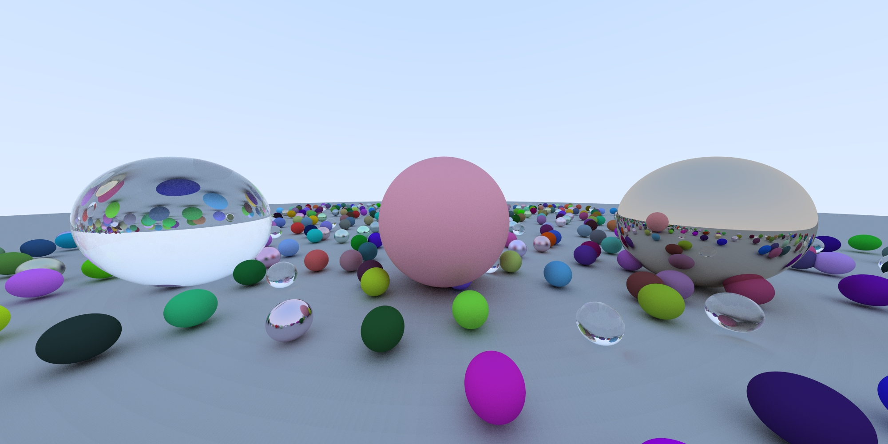
This project is a practice program for [Ray Tracing in One Weekend](https://raytracing.github.io/books/RayTracingInOneWeekend.html). Petershirley YYDS.
### Build

- You can use Clion to open proj dir on windows platform or mac platform
- Also you can use cmake and cmake build the proj.
- Also, you can use vs on windows platform.Run generate_sln.bat to generate vs solution.

### Step Pic

You can checkout the version you want:

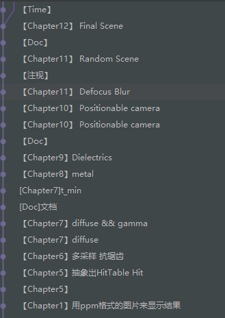

|Chapter|Pic|Descript|
|-|-|-|
|Chapter1 Output an image|||
|Chapter2 The vec3 class|||
|Chapter3 Rays, camera, backgroud|||
|Chapter4 Adding a sphere|||
|Chapter5-1 Surface normals|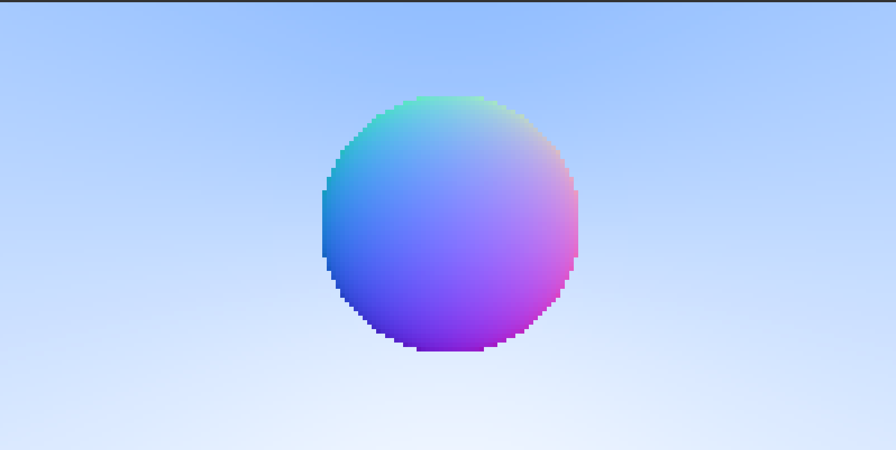||
|Chapter5-2 multiple objects|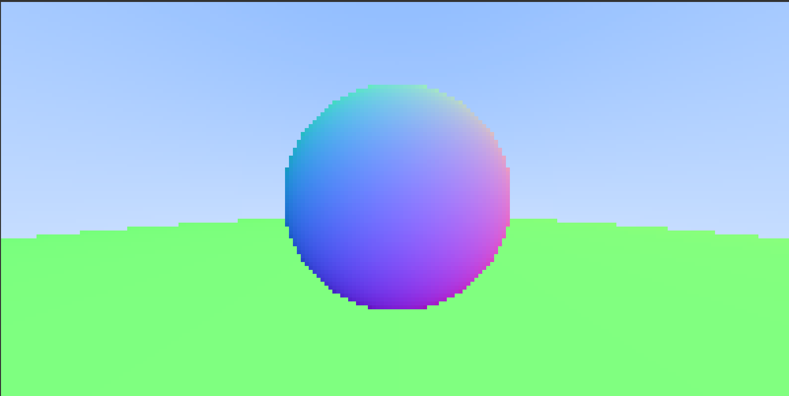||
|Chapter6 Antialiasing| 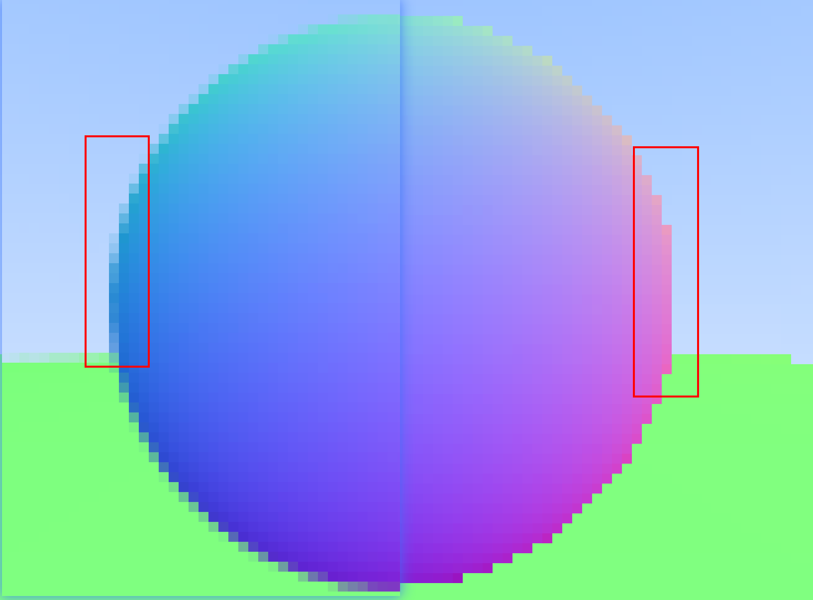||
|Chapter7-Diffuse material|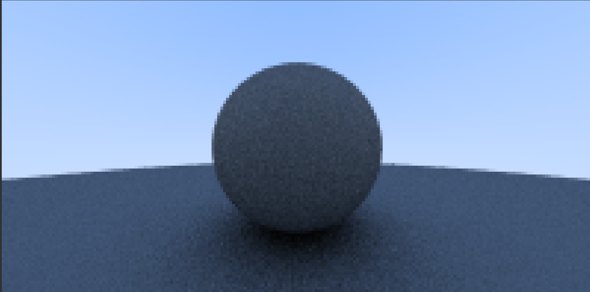||
|Chapter7-Diffuse & Gamma|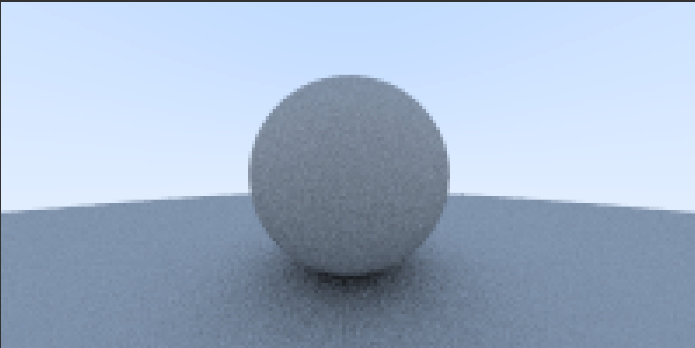||
|Chapter8 Metal|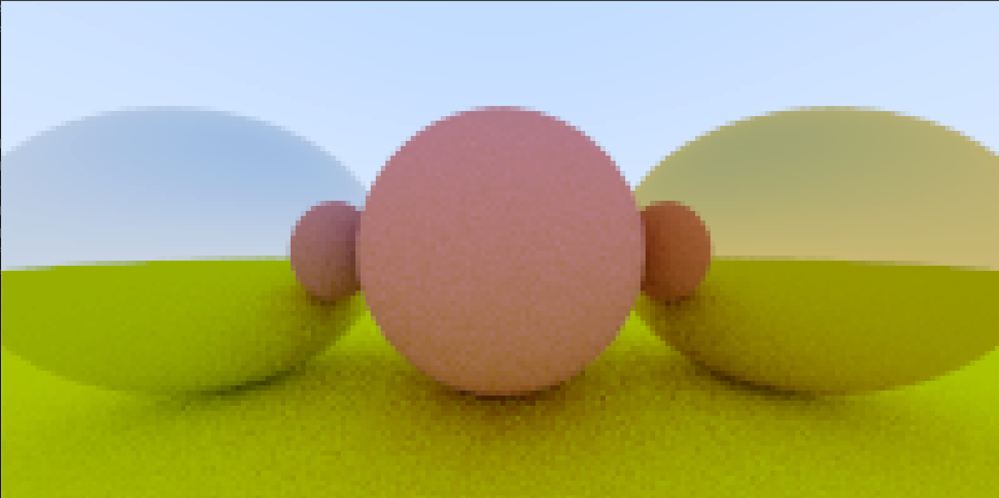||
|Chapter8 Metal Fuzz|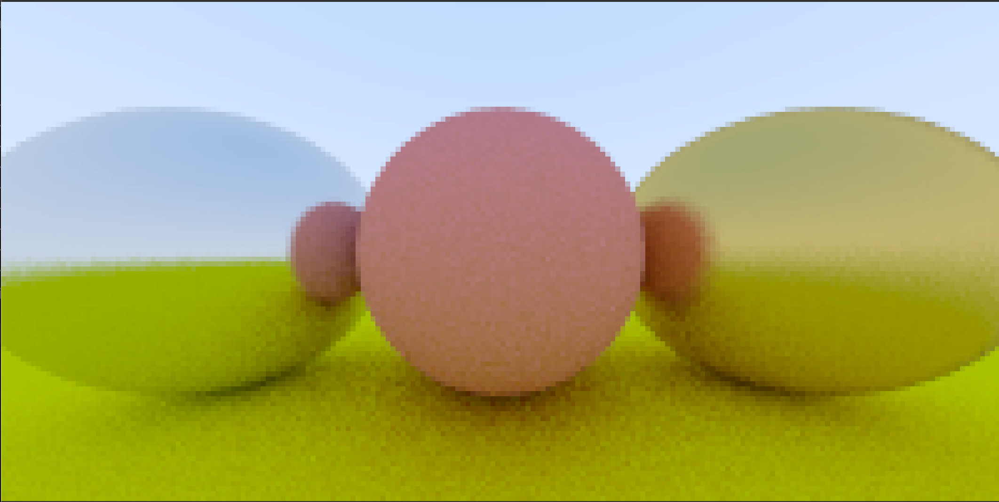||
|Chapter9 Dielectrics|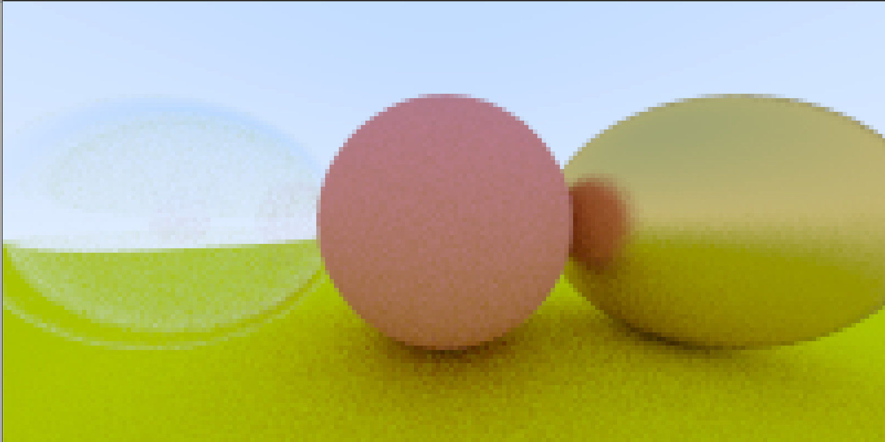||
|Chapter10 Positionable camera|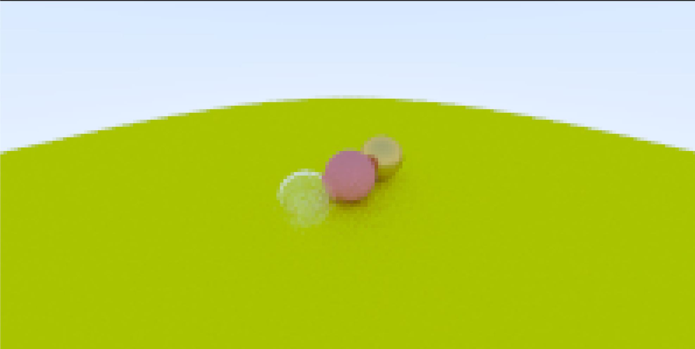||
|Chapter11 Defocus Blur|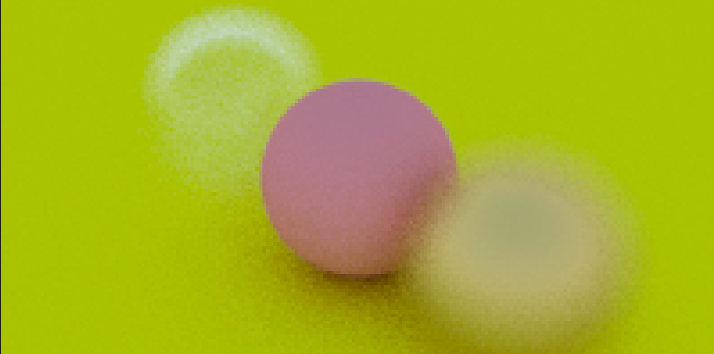||
|Chapter12 RandomScene|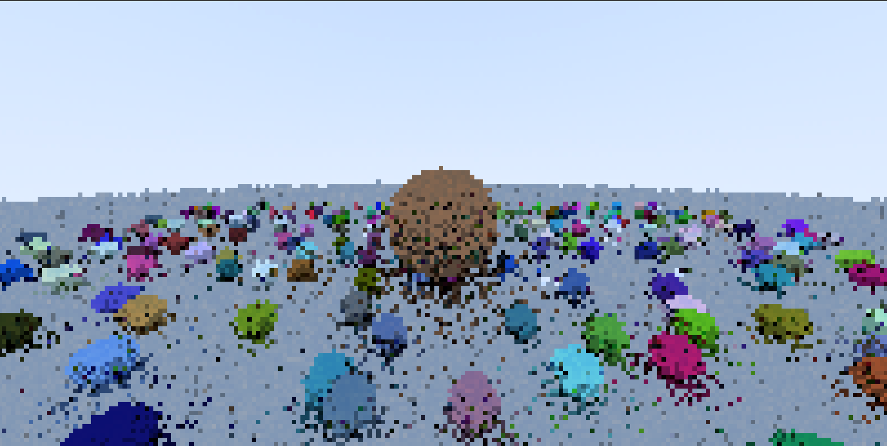||
|Chapter12 RandomScene|||

## 2. Ray Tracing The Next Week Practice Proj

### Step Pic

|Chapter|Pic|Descript|
|-|-|-|
|Chapter1 Motion Blur|||
|Chapter2 BVH|||