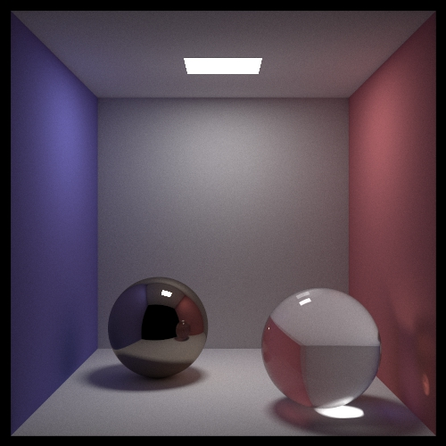
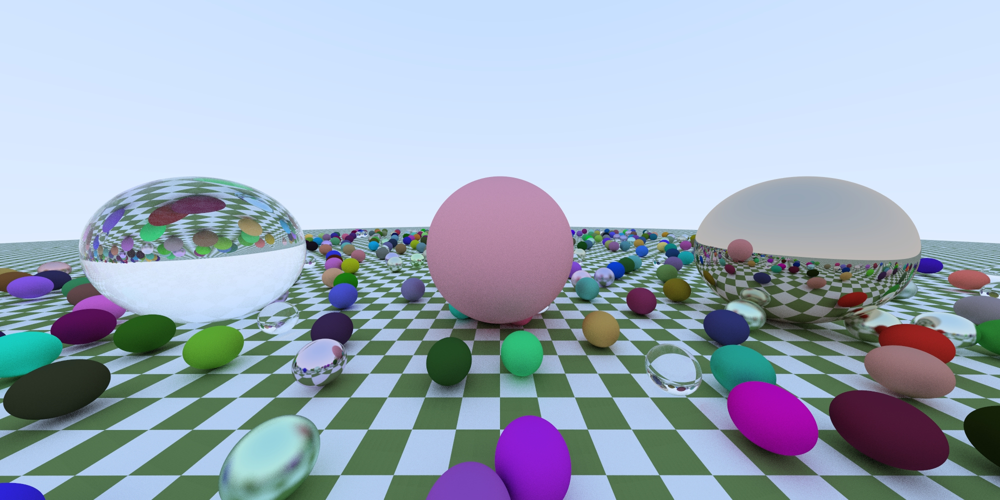
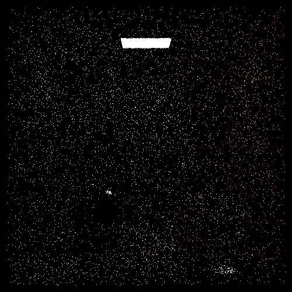
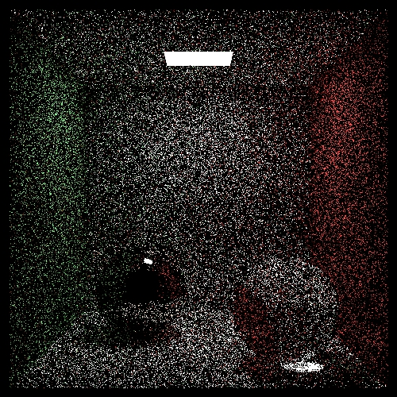
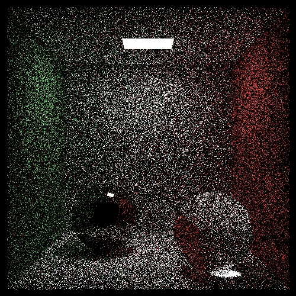
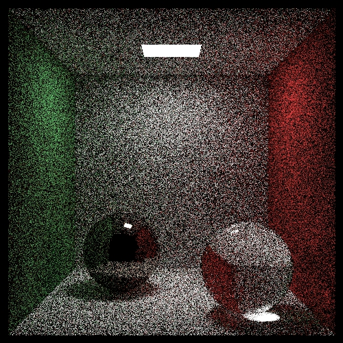
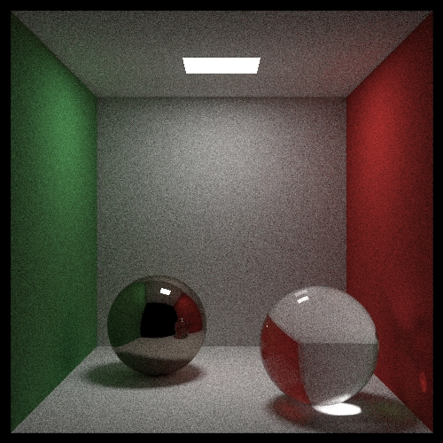

# RookieRenderer 

<!-- TOC -->

- [RookieRenderer](#rookierenderer)
  - [Final Result](#final-result)
  - [Build](#build)
  - [Run](#run)
  - [CornelBox](#cornelbox)
  - [Feature](#feature)

<!-- /TOC -->

 

## Final Result

----



----



## Build

- You can use Clion to open proj dir on windows platform or mac platform
- Also you can use cmake and cmake build the proj.
- Also, you can use vs on windows platform.Run generate_sln.bat to generate vs solution.

## Run

```cpp
//Description,Screen height,Screnn widht,Camera Position,Camera Front Direction
RunConfig(Config("CornelBox", 500, 500, 1, FVec3(278, 278, -800), FVec3(278, 278, 0)));
```

## CornelBox

|Title|Pic|Time|
|-|-|-|
|Basic path tracing 1spp||0.089 minutes Width:500 Height:500 Samples:1|
|Basic path tracing 8spp||0.13385 minutes Width:500 Height:500 Samples:8|
|Basic path tracing 12spp||0.15685 minutes Width:500 Height:500 Samples:12|
|Basic path tracing 40spp||0.46475 minutes Width:500 Height:500 Samples:40|
|Basic path tracing 200spp||1.44405 minutes Width:500 Height:500 Samples:200|
|Basic path tracing 1000spp||6.68965 minutes Width:500 Height:500 Samples:1000|
|Basic path tracing 5000spp||32.4512 minutes Width:500 Height:500 Samples:5000|
|Basic path tracing 25000spp||161.271 minutes Width:500 Height:500 Samples:25000|

## Feature

- MC PT
- Multi Thread
- gtest
